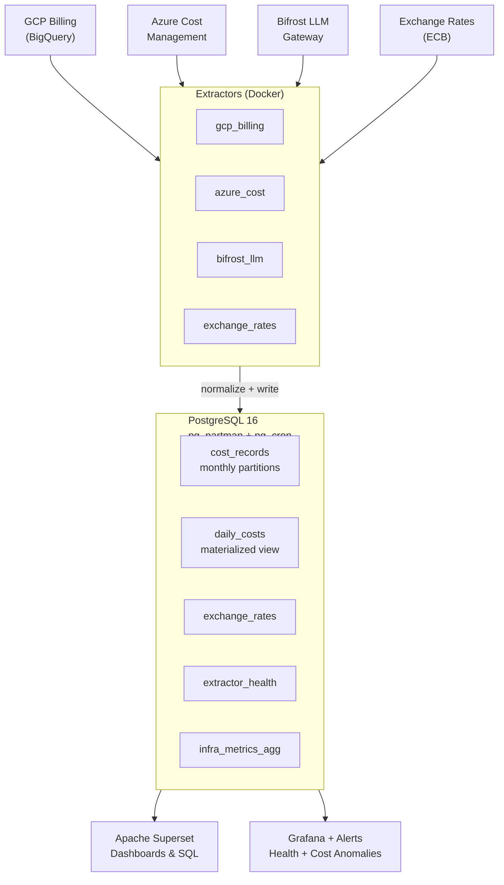

# finna-app

Multi-cloud FinOps platform — normalize, aggregate, and visualize cost data from GCP, Azure, and LLM gateways.

## Architecture



## Quick Start

```bash
# 1. Start Postgres + Bifrost
docker compose up -d postgres bifrost

# 2. Run an extractor
EXTRACTOR_TYPE=exchange_rates docker compose --profile extractors up extractor

# 3. Start Superset
docker compose up -d superset
# → http://localhost:8088  (admin / admin — change in production!)
```

## Extractors

| Type | Source | Env vars needed |
|------|--------|-----------------|
| `gcp_billing` | BigQuery billing export | `GCP_PROJECT`, `BQ_DATASET`, `BQ_TABLE`, `PG_DSN` + ADC credentials |
| `azure_cost` | Cost Management API | `AZURE_TENANT_ID`, `AZURE_CLIENT_ID`, `AZURE_CLIENT_SECRET`, `AZURE_SUBSCRIPTION_ID`, `PG_DSN` |
| `bifrost_llm` | Bifrost PostgreSQL | `BIFROST_PG_DSN`, `PG_DSN`, `BIFROST_KEY_MAPPING_PATH` |
| `exchange_rates` | ECB daily feed | `PG_DSN` only |

All extractors use `PG_DSN` to write normalized rows into `cost_records`. Run via `EXTRACTOR_TYPE` env var or the TUI wizard.

## Configuration

### TUI Wizard (interactive)

```bash
python -m config.wizard
```

Walks you through: client ID → PostgreSQL → Superset → cloud providers (GCP/Azure/Bifrost) → aggregation. Outputs `clients/{id}/config.yaml` + `.env`.

### Multi-subscription YAML

The wizard and schema support multiple GCP projects and Azure subscriptions per client. See `config/schema.py` for the full Pydantic model.

## Database Schema

`sql/init.sql` creates:

- **`cost_records`** — partitioned by month, holds all normalized cost rows (cloud + LLM)
- **`daily_costs`** — materialized view for dashboard queries, auto-refreshed every 15 min
- **`exchange_rates`** — ECB daily rates for multi-currency normalization
- **`extractor_health`** — tracks last run status per extractor
- **`infra_metrics_agg`** — pre-aggregated infra metrics (partitioned by month)

90 days of seed data (GCP + Azure + LLM) is inserted on first init.

## Deployment (GCP via Terraform)

```bash
cd terraform
cp terraform.tfvars.example terraform.tfvars
# Edit terraform.tfvars with your project/region/credentials
terraform init && terraform apply
```

Creates: Cloud Run jobs (extractors), Cloud Scheduler (cron), Secret Manager secrets, service accounts with least-privilege IAM.

## Docker Images (CI/CD)

GitHub Actions builds and pushes to **ghcr.io** on every `v*` tag:

```bash
git tag v1.0.0 && git push origin v1.0.0
```

Images produced:
- `ghcr.io/acarmisc/finops-extractor`
- `ghcr.io/acarmisc/finops-superset`

## Project Structure

```
├── aggregation/          # Aggregation pipeline config + models
├── config/               # Schema, wizard (TUI), key mappings
├── docs/                 # Operational guide, runbook, tagging strategy
├── extractors/           # One Python module per cloud source
├── models/               # Shared Pydantic models
├── onboarding/           # Client setup script
├── sql/                  # DDL + seed data
├── superset/             # Custom Superset image (config + bootstrap)
├── terraform/            # GCP infra (Cloud Run, Scheduler, IAM)
├── tests/                # Test suite
├── Dockerfile.extractor  # Multi-stage Python image
├── Dockerfile.superset   # Superset custom image
└── docker-compose.yml    # Local dev stack
```

## Contributing

This README doubles as LLM context. When contributing:

- **Extractors** follow the pattern in `extractors/gcp_billing.py` — read env vars, normalize to `cost_records` columns, batch-insert via psycopg.
- **Schema changes** go in `config/schema.py` (Pydantic) and `sql/init.sql` (DDL). New fields must be nullable or have defaults.
- **TUI** lives in `config/wizard.py` — use `questionary` for prompts, `rich` for output.
- **No secrets in code** — all credentials via env vars or `${VAR}` placeholders in YAML. The `.gitignore` blocks `*credentials*`, `*service-account*`, `*.pem`, `*.key`, `.env*`.
- **Terraform** uses variable files (`*.tfvars`) — never commit real `.tfvars`, only the `.example` template.

## Security Notes

- Docker images run as non-root (`appuser` / `superset`)
- Dev defaults (`finops_dev`, `admin`) in `docker-compose.yml` are for local dev only — override via env vars in production
- GCP uses Application Default Credentials; Azure uses `ClientSecretCredential`
- Superset secret key must be overridden via `SUPERSET_SECRET_KEY` env var

## License

Proprietary — internal use only.